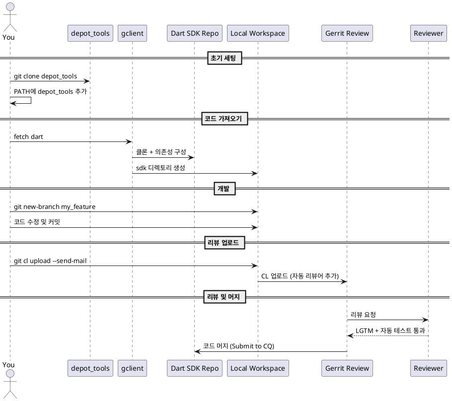

```plantuml
@startuml
actor You
participant "depot_tools" as Depot
participant "gclient" as Gclient
participant "Dart SDK Repo" as SDK
participant "Local Workspace" as Local
participant "Gerrit Review" as Gerrit

== 초기 세팅 ==
You -> Depot: git clone depot_tools
You -> You: PATH에 depot_tools 추가

== 코드 가져오기 ==
You -> Gclient: fetch dart
Gclient -> SDK: 클론 + 의존성 구성
Gclient -> Local: sdk 디렉토리 생성

== 개발 ==
You -> Local: git new-branch my_feature
You -> Local: 코드 수정 및 커밋

== 리뷰 업로드 ==
You -> Local: git cl upload --send-mail
Local -> Gerrit: CL 업로드 (자동 리뷰어 추가)

== 리뷰 및 머지 ==
Gerrit -> Reviewer: 리뷰 요청
Reviewer --> Gerrit: LGTM + 자동 테스트 통과
Gerrit -> SDK: 코드 머지 (Submit to CQ)

@enduml

```
