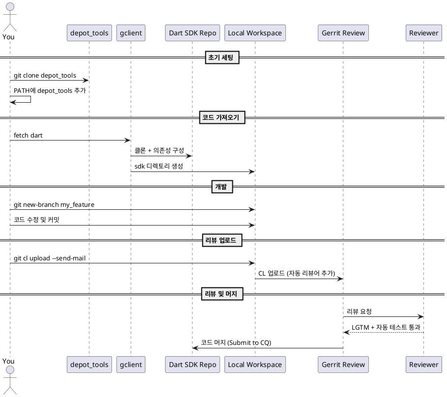
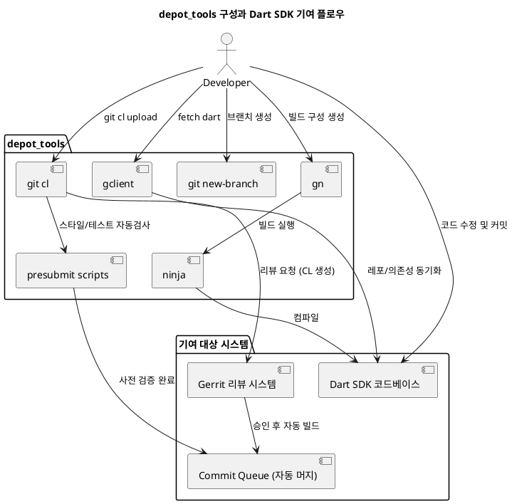

---
tags:
  - dart
  - contribution
  - build_tool
created: 2025-04-11
---
#### Dart SDK 컨트리뷰션 플로우




#### 내부 구성



#### 주요 키워드 

**Git CL 이란?**
- **Google Gerrit** 기반 프로젝트에서 코드 리뷰(CL = changelist)를 관리하는 도구
- GitHub의 "Pull Request"에 해당되는 개념
- 한 번의 `git cl upload`가 = 하나의 코드 리뷰 요청을 Gerrit에 올리는 행위

|명령어|기능|
|---|---|
|`git cl upload`|현재 브랜치의 변경사항을 **Gerrit 리뷰 시스템에 업로드**|
|`git cl web`|해당 changelist(CL)를 웹 브라우저에서 바로 열기|
|`git cl diff`|Gerrit에 올릴 diff를 로컬에서 미리보기|
|`git cl presubmit`|업로드 전에 포맷 검사, 테스트 등 **사전 체크** 수행|
|`git cl set-commit`|Gerrit에서 승인된 CL을 **자동 머지 대기열(CQ)에 등록**|

**gclient란?**
- Google 프로젝트(Dart, Flutter)의 수많은 하위 레포들을 한 번에 가져오고 동기화해주는 메타 관리 도구
- depot_tools에 포함되어있음
- git처럼 보이지만 레포 간 의존성/구성 관리에 특화된 도구(일반적인 `git clone`만으로는 Dart SDK 같은 복잡한 구조를 구성할 수 없기 때문)

**gn이란?**
- Dart SDK는 너무 저수준이라서 Flutter처럼 `build.yaml` 같은 고수준 도구를 쓰지 않음
- 대신 **Google 내부 스타일 빌드 시스템** (`gn`, `ninja`)을 씀
- Dart SDK의 코드는 "재료"일 뿐이고,  `BUILD.gn` 파일은 그 재료를 어떤 방식으로 빌드할지 틀(레시피)를 정의 
- `gn`은 이 `BUILD.gn`들을 읽고 → `ninja`가 이해할 수 있는 **build.ninja** 파일(설계도)을 만들어.
- 그 후 `ninja`가 이 파일을 보고, **소스 코드들, 의존성, 빌드 대상들을 연결하고 빌드 수행**해.
- 이 과정을 다 거쳐야 Dart SDK가 실제로 컴파일되고, 테스트되고, 검증되고, 리뷰될 준비가 된다!

| 주인공            | 역할          | 설명                             |
| -------------- | ----------- | ------------------------------ |
| 🧑‍🎨 `gn`     | 설계도 만드는 건축가 | 어떤 재료로 어떤 순서로 어떻게 지을지 정함       |
| 👷 `ninja`     | 시공사         | 설계도 보고 진짜로 건물을 짓는 역할           |
| 📄 `BUILD.gn`  | 재료명세서 + 시방서 | `gn`이 읽는 설정 파일                 |
| 📁 `out/Debug` | 공사 현장       | 여기에 결과물(.exe, .a, .dill 등)이 생김 |

|도구|하는 일|
|---|---|
|`gn`|`BUILD.gn` 읽어서 → ninja가 읽을 수 있는 `build.ninja` 생성|
|`ninja`|`build.ninja`를 보고 → 실제 Dart SDK 컴파일 수행|


#### Dart SDK 실전 컨트리뷰트 순서

Dart SDK는 일반적인 패키지 PR과 다르게, Google 내부 인프라 기반 도구들(depot_tools, gclient, gn, ninja)을 이용해야 한다. 복잡해 보이지만, 단계를 따라가면 충분히 기여할 수 있다.

---

 **1️⃣ 환경 설정**

 **✅ 필수 도구 설치**

- **Python 3**
    
- **Homebrew (macOS)** or apt (Linux)
    
- **Xcode** (macOS)
    
- **Visual Studio + Windows SDK** (Windows)

 **✅ depot_tools 설치**

```bash
git clone https://chromium.googlesource.com/chromium/tools/depot_tools.git
export PATH="$PATH:$PWD/depot_tools"
```

> depot_tools는 `gclient`, `git cl`, `gn`, `ninja` 등을 포함한 Google 오픈소스 기여용 툴 모음이다.

---

**2️⃣ SDK 소스코드 가져오기**

```bash
mkdir dart-sdk
cd dart-sdk
fetch dart
```

> `git clone`이 아닌 `fetch dart`를 사용하는 이유는 `gclient`가 여러 하위 레포와 의존성을 함께 구성하기 때문.

---

**3️⃣ 브랜치 생성 및 개발 시작**

```bash
cd sdk
git new-branch fix_my_issue
```

- 브랜치 만들고
    
- `sdk/` 내의 Dart 소스 코드 수정
    
- `git commit` 으로 변경사항 저장
    

---

**4️⃣ Dart SDK 빌드**

```bash
./tools/build.py --mode release --arch x64 create_sdk
```

> macOS의 경우 결과물은 `xcodebuild/ReleaseX64/dart-sdk/`에 생성됨.  
> Debug 모드가 필요하면 `--mode debug` 사용 가능.

---

**5️⃣ 변경사항 테스트**

```bash
./tools/test.py -mrelease -a x64 --runtime vm corelib
```

- 특정 테스트만 돌리고 싶다면 `corelib/SomeTest`로 지정 가능
    
- analyzer나 dart2js 테스트도 지원됨

---

**6️⃣ CL(Gerrit 리뷰) 업로드**

```bash
git cl upload --send-mail
```

- 자동으로 관련 OWNERS가 리뷰어로 추가됨
- 리뷰는 [https://dart-review.googlesource.com](https://dart-review.googlesource.com/)에서 진행됨

```bash
git cl web
```

- 리뷰 CL 웹 UI 열기  

---

 **7️⃣ 리뷰 통과 후 자동 머지**

- 리뷰어 2명의 **LGTM** + **자동 presubmit 테스트 통과** 시
- Gerrit에서 “Submit to CQ” → **자동 머지**


---
#### 용량 정리 방법

`create_sdk`를 한 번 돌리면 기본적으로:

|폴더|용도|대략 용량|
|---|---|---|
|`xcodebuild/ReleaseX64/`|빌드 산출물 (.exe, .dill, .a 등)|1~3 GB|
|`out/DebugX64/`, `out/ReleaseX64/`|디버그 빌드 결과|1~2 GB|
|`.dart_tool/`, `.gclient`, `.git`|메타 정보, 캐시|수백 MB ~ 1GB|
|`depot_tools/`|빌드 도구 모음|수백 MB|

> 합치면 5~7GB 정도는 우습게 차지
> 특히 **Debug 모드 빌드**를 여러 번 반복하면 디스크 압박이 생김

---

#### 🧹 용량 정리 방법

**🔨 전체 SDK 삭제**

```bash
cd ~
rm -rf dart-sdk
```

- `fetch dart`로 받은 소스 + 빌드결과 + 테스트 캐시까지 몽땅 날아감
    
- `depot_tools`도 같이 지우고 싶으면:
    

```bash
rm -rf depot_tools
```

---

**🧼 빌드 결과만 삭제하고 소스는 남기고 싶다면**

```bash
cd dart-sdk/sdk
rm -rf out
rm -rf xcodebuild
```

> 이렇게 하면 **다음 빌드할 때 다시 생성되긴 하지만**, 공간은 당장 확보.  
> 테스트 결과 캐시까지 지우고 싶다면:

```bash
rm -rf .dart_tool
```

---

**⚠️ 조심할 것**

- `git cl`이나 `gclient`가 `.gclient`, `.git`, `.gclient_entries`를 사용하므로 → **절대 이것들은 막 지우지 마세요**  
    (지우면 fetch부터 다시 해야 됨)
    

---

**💡 실전 팁: 중간중간 cleanup 추천**

```bash
./tools/clean_output.py
```

> Dart SDK에서는 이 스크립트로 `out/`, `xcodebuild/`, `build/` 폴더를 자동 정리할 수 있음.

---

**✨ 요약**

|질문|답변|
|---|---|
|용량 많이 먹음?|✅ 5~7GB 이상 충분히 차지함|
|삭제 가능?|✅ 전부 또는 일부 폴더만 정리 가능|
|조심할 것|`.gclient`, `.git`, `.gclient_entries`는 보존 필요|
|자동 청소법?|`./tools/clean_output.py` 추천|
