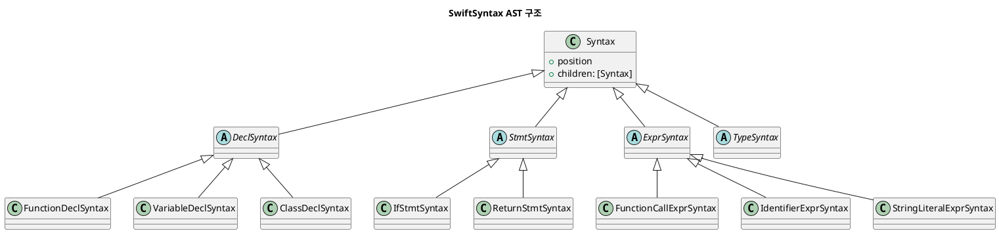
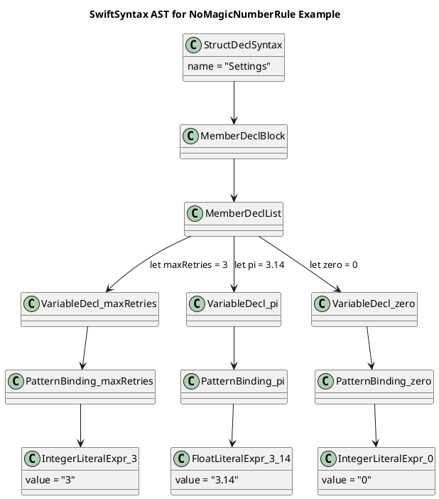

---
tags:
  - swift_lint
  - swift
  - ast
created: 2025-04-13
---
#### SwiftLint는 SwiftSyntax 기반으로 기능을 얹은 라이브러리이다
```plaintext
                            ┌────────────────────────┐
                            │     SwiftSyntax (Apple)│
                            └────────────────────────┘
                                     ▲
                         Uses AST from SwiftSyntax
                                     │
                            ┌────────────────────────┐
                            │      SwiftLint (Realm) │
                            │  - Rule System         │
                            │  - Configuration       │
                            │  - Linter Engine       │
                            │  - CLI & Reporter      │
                            └────────────────────────┘

```

---
#### 작동원리

1. 사용자가 swiftlint 실행하거나 파일 저장
   ↓
2. Swift 파일을 연다 (단순한 텍스트)
   ↓
3. SwiftSyntax로 문법 트리(AST)를 만든다
   ↓
4. 트리를 돌면서 룰(Rule)들을 적용한다
   ↓
5. 문제가 있으면 StyleViolation을 만든다
   ↓
6. 경고를 CLI/Xcode에 출력하거나 자동 수정

```swift
let file = try SwiftLintFile(path: "MyFile.swift")
// → 1. 파일을 읽고
// → 2. SwiftSyntax로 AST를 만든다

for rule in allRules {
    let violations = rule.validate(file: file)
    // → 3. 각 룰이 AST를 순회하며 위반 사항 찾음
}
```

---

### 실제 작동 순서


**실제 Swift 코드 → AST 트리 → Visitor 순회 → StyleViolation 감지**

**01. 코드 예제**

```swift
struct Circle {
    let radius = 42
    let pi = 3.14
    let threshold = 0.5
    let zero = 0
}
```

**02. 이 코드의 AST 구조**

```
StructDeclSyntax (Circle)
└─ MemberDeclList
   ├─ VariableDeclSyntax (radius = 42)
   │  └─ IntegerLiteralExprSyntax ("42")
   ├─ VariableDeclSyntax (pi = 3.14)
   │  └─ FloatLiteralExprSyntax ("3.14")
   ├─ VariableDeclSyntax (threshold = 0.5)
   │  └─ FloatLiteralExprSyntax ("0.5")
   └─ VariableDeclSyntax (zero = 0)
      └─ IntegerLiteralExprSyntax ("0")
```

 **✅ Step 1: `SwiftLintFile`이 AST 트리 생성**

```swift
let file = SwiftLintFile(path: "Circle.swift")
// → SwiftSyntax로 AST 트리 생성됨
```

 **✅ Step 2: `NoMagicNumbersRule`의 `validate(file:)` 호출**

```swift
func validate(file: SwiftLintFile) -> [StyleViolation] {
    let visitor = NoMagicNumberVisitor()
    visitor.walk(file.syntaxTree) // AST 전체 순회 시작
    return visitor.violations
}
```
 
 **✅ Step 3: `SyntaxVisitor`가 숫자 노드 방문**

```swift
override func visit(_ node: IntegerLiteralExprSyntax) -> SyntaxVisitorContinueKind {
    if node.value == "0" { return .skipChildren } // 예외
    reportViolation(value: node.value, location: node.position)
}

override func visit(_ node: FloatLiteralExprSyntax) -> SyntaxVisitorContinueKind {
    if node.value == "3.14" || node.value == "0.0" { return .skipChildren } // 예외
    reportViolation(value: node.value, location: node.position)
}
```

**03. 실제 감지 결과**

|값|노드 타입|허용 여부|결과|
|---|---|---|---|
|`42`|IntegerLiteralExprSyntax|❌|❗️Violation|
|`3.14`|FloatLiteralExprSyntax|❌|❗️Violation|
|`0.5`|FloatLiteralExprSyntax|❌|❗️Violation|
|`0`|IntegerLiteralExprSyntax|✅|✅ 패스|

**04. 최종 출력 예시 (Xcode나 CLI에서)**

```
Circle.swift:2:17: warning: Avoid magic numbers: 42
Circle.swift:3:15: warning: Avoid magic numbers: 3.14
Circle.swift:4:21: warning: Avoid magic numbers: 0.5
```


**05. 최종 동작 요약**

```plaintext
[Swift File] ──▶ [SwiftSyntax AST Tree]
                     │
                     ▼
        [NoMagicNumberRule] (Visitor)
             ├─ visit 42 → ❗️
             ├─ visit 3.14 → ❗️
             ├─ visit 0.5 → ❗️
             └─ visit 0 → ✅ (예외)
```

---
#### 여기서 나온 AST (Abstract Syntax Tree) 란?

**"코드를 트리처럼 해석한 구조"**



```
Syntax
├── DeclSyntax        → 선언
│   ├── FunctionDeclSyntax
│   ├── VariableDeclSyntax
│   └── ClassDeclSyntax
├── StmtSyntax        → 실행 문장
│   ├── IfStmtSyntax
│   └── ReturnStmtSyntax
├── ExprSyntax        → 값 계산
│   ├── FunctionCallExprSyntax
│   └── StringLiteralExprSyntax
└── TypeSyntax        → 타입
    ├── OptionalTypeSyntax
    └── ArrayTypeSyntax

```

Swift 코드가 단순한 텍스트에서 의미 있는 구조로 바뀌는 과정.

예시 Swift 코드:

```swift
if isLoggedIn {
    showHome()
} else {
    showLogin()
}
```

이 코드는 아래처럼 **트리 구조(AST)** 로 표현

```
IfStmtSyntax
├─ Condition: isLoggedIn
├─ Body:
│  └─ FunctionCallExprSyntax: showHome()
└─ ElseBody:
   └─ FunctionCallExprSyntax: showLogin()
```

> 즉, "if 문"은 `IfStmtSyntax`라는 노드이고, 그 안에 조건과 본문이 자식 노드로 매달리는 구조.

---
#### SwiftSyntax가 사용하는 구조는 **방문자 디자인 패턴(Visitor Pattern)**

|구성 요소|설명|
|---|---|
|**Element**|방문될 대상 (e.g. `FunctionDeclSyntax`)|
|**Visitor**|로직을 담는 방문자 객체 (e.g. `SyntaxVisitor`)|
|**accept()**|방문자를 받아들이는 메서드 (e.g. 내부적으로 SwiftSyntax가 자동 호출)|


#### `visit` vs `visitPost` 동작 비교

SwiftSyntax는 **DFS(Depth-First Search)** 방식으로 AST를 순회한다.
```swift
/*
visit(node)
   ↓
(재귀적으로 자식 노드 순회)
   ↓
visitPost(node)
*/

override func visit(_ node: VariableDeclSyntax) -> SyntaxVisitorContinueKind {
    print("🟢 visit VariableDeclSyntax")
    return .visitChildren
}

override func visitPost(_ node: VariableDeclSyntax) {
    print("🔵 visitPost VariableDeclSyntax")
}

/*
🟢 visit VariableDeclSyntax
🟢 visit PatternBindingSyntax
🟢 visit IntegerLiteralExprSyntax
🔵 visitPost IntegerLiteralExprSyntax
🔵 visitPost PatternBindingSyntax
🔵 visitPost VariableDeclSyntax
*/
```
- `visit`: 일반적으로 Rule 탐지 시 사용
- `visitPost`: 하위 노드 분석 후 판단할 때 사용

**DFS 탐색을 NoMagicNumberRule 에 적용하면...**
```swift
struct Settings {
    let maxRetries = 3
    let pi = 3.14
    let zero = 0
}
```


**DFS 순회 순서**

1. `StructDeclSyntax` 방문
    
2. `MemberDeclBlock` 들어감
    
3. `MemberDeclList` 들어감
    
4. 첫 번째 선언 → `VariableDecl_maxRetries`
    
5. 그 안의 `PatternBinding_maxRetries`
    
6. 그 안의 `IntegerLiteralExpr_3` ← **여기서 Magic Number 감지**
    
7. 다음 형제로 이동 → `VariableDecl_pi`
    
8. `PatternBinding_pi`
    
9. `FloatLiteralExpr_3_14` ←  **또 감지**
    
10. 다음 형제로 이동 → `VariableDecl_zero`
    
11. `PatternBinding_zero`
    
12. `IntegerLiteralExpr_0` ← **이건 허용**


---

 **✅ `conditions.count == 1`인 경우**

```swift
if a && b {
  // 이 경우 조건은 단 하나임 (조건 전체가 'a && b' 라는 한 개의 expression)
}
```

**❌ `conditions.count > 1`인 경우**

```swift
if a, b {
  // 이건 Swift에서 'condition list'라고 부르고
  // a, b 두 개의 조건이 있음 → conditions.count == 2
}
```

우리가 잡아내고 싶은 패턴은:

- `if a && b` 처럼 **불리언 연산자로 연결된 하나의 조건식**
    

반대로 이미 이렇게 되어있으면:

- `if a, b` → Swift스럽게 잘 쓴 것이므로 **룰 적용 대상이 아님**.
    

그래서 이런 식으로 필터링:

```swift
guard conditions.count == 1,
      let firstCondition = conditions.first,
      case .expression(let expr) = firstCondition.condition else {
    return
}
```

1. 조건이 오직 하나만 있고 (예: `a && b`)
    
2. 그 조건이 `if let` 같은 바인딩이 아니라, **순수한 표현식일 때만 검사하겠다**

---