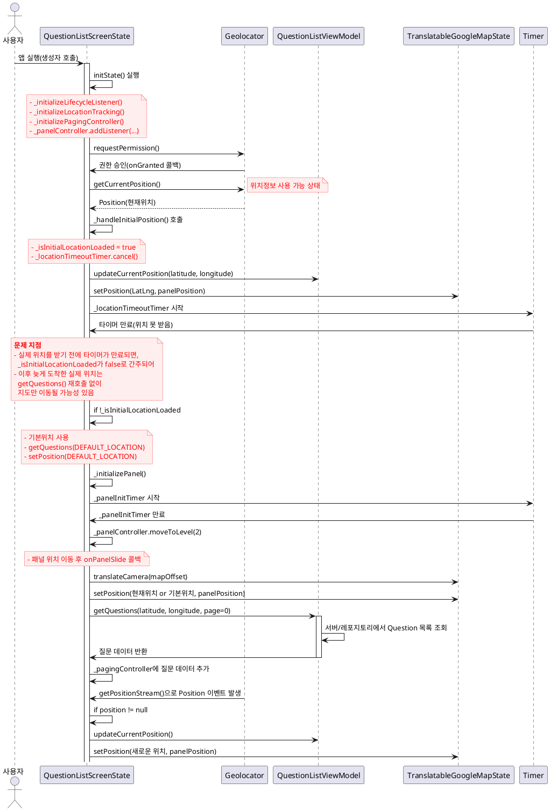

1. **현재 위치를 받으면(onGranted 콜백 성공 시점):**
- 이미 `_locationTimeoutTimer`가 만료되었더라도, 
- **강제로 다시** `getQuestions(실제위치)`를 호해 **질문 목록**과 **지도 위치**가 동기화되도록 합니다.

2. **혹은 타임아웃 방식을 없애거나 더 길게 주고,**
- 위치가 늦게 오더라도 `DEFAULT_LOCATION`으로 질문을 먼저 보여주고,
- **뒤늦게라도** 위치가 오면 `getQuestions(실제위치)`를 다시 호출하여 데이터를 새로 불러옵니다.

3. **만약 최대한 빨리 사용성(지도 표시, 질문 표시)을 보장해야 한다면,**
- 초기에만 기본 위치로 빠르게 세팅 후,
- 위치가 도착하면 **바로** 현재 위치로 재세팅 + `getQuestions()` 재호출  
- 이런 식으로 **두 번 로드**하는 전략을 사용합니다(UX 트레이드오프 고려).